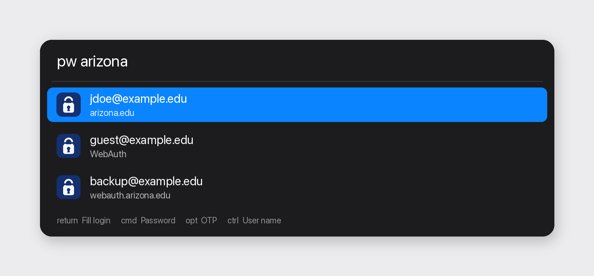

# iCloud Passwords Revamp

An [Alfred](https://www.alfredapp.com/) workflow for Apple’s Passwords app on macOS Sequoia, Tahoe, and Golden Gate.

Search your iCloud logins from Alfred. Results show the email (or user name) on the first line and the site or URL underneath. Press return to fill the login form in the app you were using.



This is a standalone Alfred workflow. It talks to the Passwords app on the Mac that runs it. It does not include anyone else’s vault.

## Install

Requires Alfred 5 with the Powerpack, and macOS Sequoia or later.

1. Download `iCloud-Passwords-Revamp.alfredworkflow` from [Releases](https://github.com/qwertyuiop97/icloud-passwords-revamp/releases).
2. Double-click the file to add it in Alfred.
3. Grant Accessibility to Alfred: System Settings → Privacy & Security → Accessibility.
4. The first search may ask you to unlock Passwords with Touch ID.

## Usage

Type `pw` in Alfred, then a site, app name, URL, user name, or email.

| Input | What happens |
| --- | --- |
| `pw arizona` | Lists matching logins under the query |
| ↩ | Fills user name, then password |
| ⌘↩ | Copies the password |
| ⌥↩ | Copies the verification code |
| ⌃↩ | Copies the user name |
| ⇧↩ | Opens the item in Passwords |

On a campus WebAuth page (NetID + Password), pick the row for the right email and press return. NetID is filled first, then the password field. A password is never pasted into a user name, email, or NetID field.

If the window only has a user name field, only the user name is filled. If it only has a password field, only the password is filled.

## Configuration

Open the workflow in Alfred and click Configure Workflow:

| Setting | Default |
| --- | --- |
| Search keyword | `pw` |
| Fill user name and password together on login forms | on |
| Quit Passwords after filling or copying | off |

## Unlocking

There is no public API for iCloud Keychain, so the workflow uses the Passwords app in the background.

The first time the vault is locked, Passwords may come forward for Touch ID. After that, leave it running. Later `pw` searches should stay in Alfred and should not ask again until Passwords quits or the Mac locks the vault.

Do not turn on **Close after fill** unless you want to unlock every time.

## How it works

Alfred does not get a public API for iCloud Keychain, so the workflow drives the Passwords app through Accessibility.

- Search results are site + user name only. The password is not in the JSON Alfred sees.
- Filling uses Passwords’ own Copy User Name / Copy Password / Copy Code menu items. The Python code never reads the secret.
- Before a password is pasted, the focused field has to be a password field (`AXSecureTextField`). If it is not, paste is aborted and the clipboard is cleared.
- Copied passwords are marked with `org.nspasteboard.ConcealedType` so clipboard history tools can skip them.

## Development

```sh
PYTHONPATH=. python3 -m unittest discover -s tests -v
python3 docs/render_screenshots.py
python3 build.py
```

`python3 build.py` writes `info.plist` and `dist/iCloud-Passwords-Revamp.alfredworkflow`.

## License

MIT. See [LICENSE](LICENSE).
